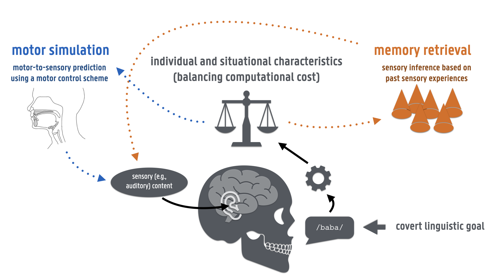

# What covert verbal actions tell us about the interplay between language, action, and perception

## Abstract

Humans have a remarkable ability to imagine actions without executing them. Such motor imagery is accompanied by a subjective multi-sensory experience with auditory, visual, and kinaesthetic components. An influential hypothesis states that these sensory percepts result from a simulation of the corresponding motor action that relies on the same internal models recruited for the control of overt actions. A significant consequence of this hypothesis is that the sensory experience of covert actions would be continuously shaped by sensorimotor interactions with the environment. However, the precise computations required by these internal models and their neural implementation remain unclear. Moreover, this simulationnist view raises the question of how it is possible to imagine actions without executing them. In this perspective, we focus on covert verbal actions such as covert speech, writing, or typing, as an exciting case study to help understanding the interplay between language, motor control, and perceptual processes.

